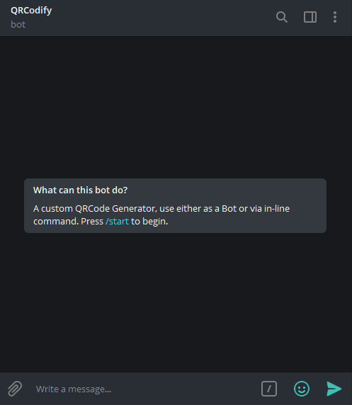

# QRCodifyBot
Check out the functioning bot on Telegram [here](https://t.me/QRCodifyBot)

This is my experimental codes for Telegraf 4.X Wizard Scenes.

## Screenshots

## Libraries used
- NodeJS
- Telegraf
- [Easyqrcodejs-nodejs](https://github.com/ushelp/EasyQRCodeJS-NodeJS)
- Dotenv

## Notes:
For the plain QR code, it is using the Free API call found [here](http://goqr.me/api/)  
.env file is excluded for security purposes   
Procfile is for Heroku Deployment  

## Resources:
[Official Telegram Docs](https://core.telegram.org/bots/api)  
[Telegraf Inline Menu](https://www.npmjs.com/package/telegraf-inline-menu)(Did not use this, although it will be good to implement)  
[Telegraf V3 Docs](https://telegraf.js.org/v3)  
[Telegraf V4 Docs](https://telegraf.js.org/classes/composer.html)  
